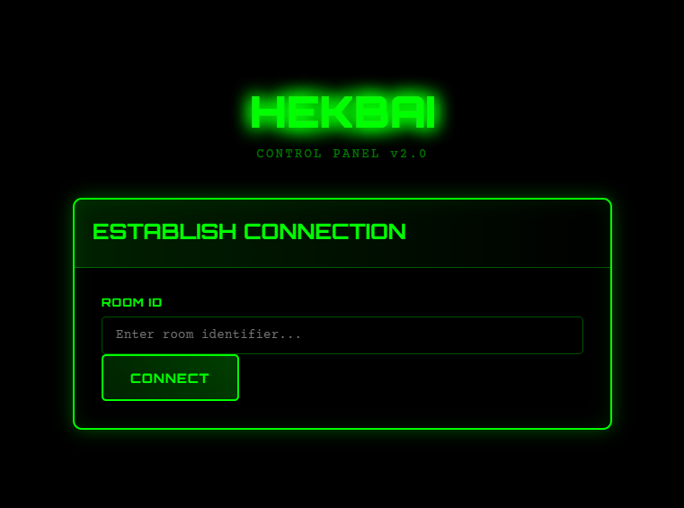
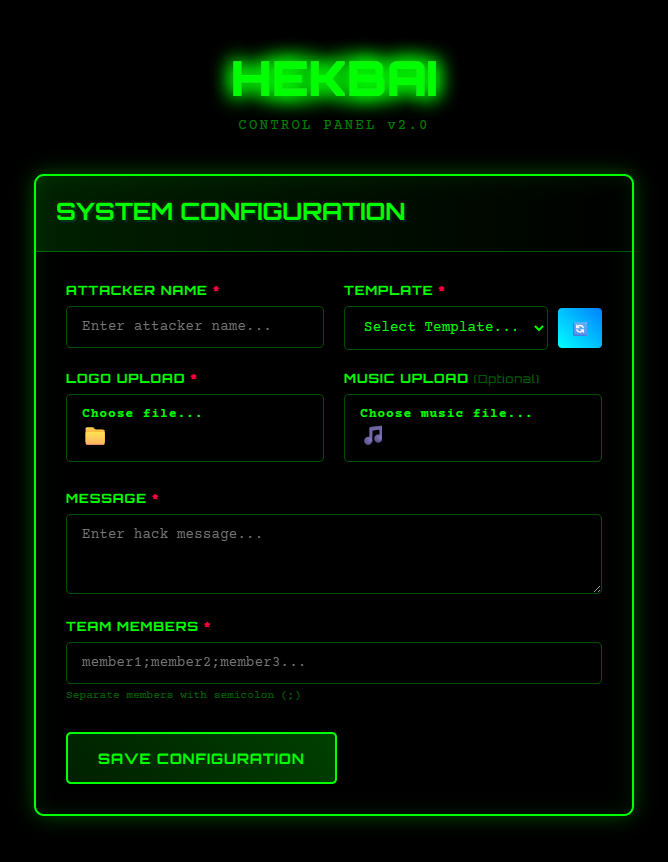
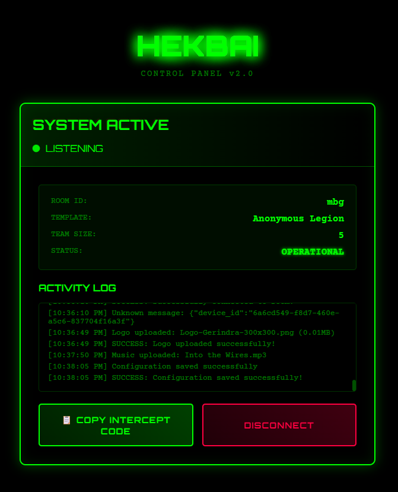

# HEKBAI - Web Attack Simulation Framework

⚠️ **EDUCATIONAL PURPOSE ONLY** ⚠️

This project is created **STRICTLY FOR EDUCATIONAL AND RESEARCH PURPOSES ONLY**. It is designed to help security researchers, ethical hackers, and cybersecurity students understand web attack vectors and develop better defense mechanisms.

## 🎮 Demo

**Live Demo:** [https://hekbai.jefripunza.com](https://hekbai.jefripunza.com)

### Screenshots

#### 1. Room Entry Interface
Enter or create a room to establish connection between attacker and target.



#### 2. Attack Configuration Panel
Configure your attack parameters including attacker name, team members, message, and select from multiple hack templates.



#### 3. Listening for Targets
Real-time monitoring dashboard showing connected targets and attack status.




## 🚨 LEGAL DISCLAIMER

- **Educational Use Only**: This tool is intended solely for educational purposes and authorized security testing
- **No Malicious Intent**: Any malicious use of this software is strictly prohibited
- **User Responsibility**: Users are fully responsible for any actions taken with this software
- **Legal Compliance**: Ensure you have proper authorization before testing on any systems
- **No Liability**: The developers are not responsible for any misuse or damage caused by this software

## 🛡️ Ethical Guidelines

- Only use on systems you own or have explicit written permission to test
- Never use this tool for illegal activities or unauthorized access
- Respect privacy and data protection laws
- Use responsibly and ethically at all times

## 🔧 Installation

To install dependencies:

```bash
bun install
```

## 🚀 Usage

### Development Mode
```bash
yarn dev
# or
bun run index.ts
```

### Production Build
```bash
yarn compile
```

## 📋 Features

- Web attack simulation templates
- Real-time WebSocket communication
- Anti-exit protection mechanisms
- Logo and music integration
- Multiple attack vectors for educational analysis

## 🎯 Educational Objectives

This framework helps students and researchers understand:
- Web application security vulnerabilities
- Client-side attack vectors
- Browser security mechanisms
- Defense strategies and countermeasures

## ⚖️ Legal Notice

**BY USING THIS SOFTWARE, YOU ACKNOWLEDGE THAT:**
- You understand this is for educational purposes only
- You will not use it for any illegal or unauthorized activities
- You take full responsibility for your actions
- The developers disclaim all liability for misuse

---

*This project was created using `bun init` in bun v1.2.10. [Bun](https://bun.sh) is a fast all-in-one JavaScript runtime.*
